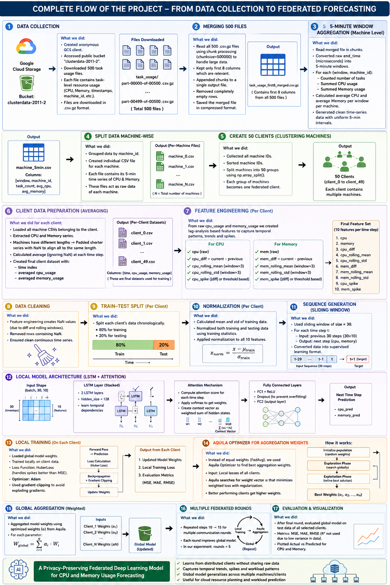
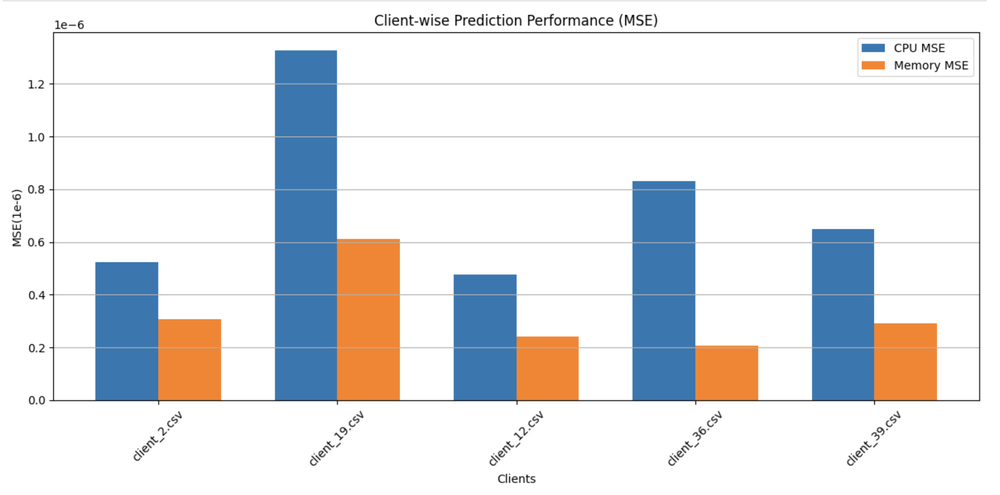
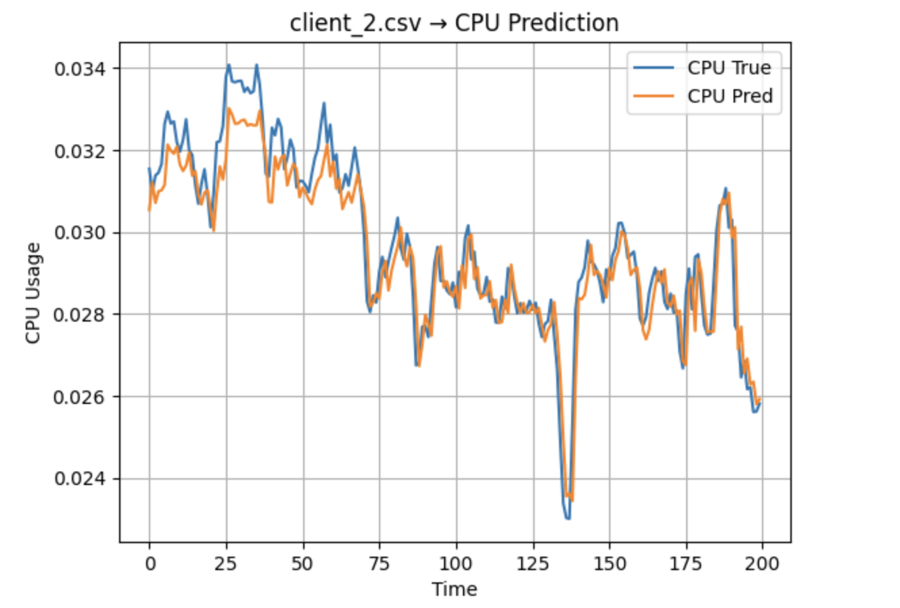
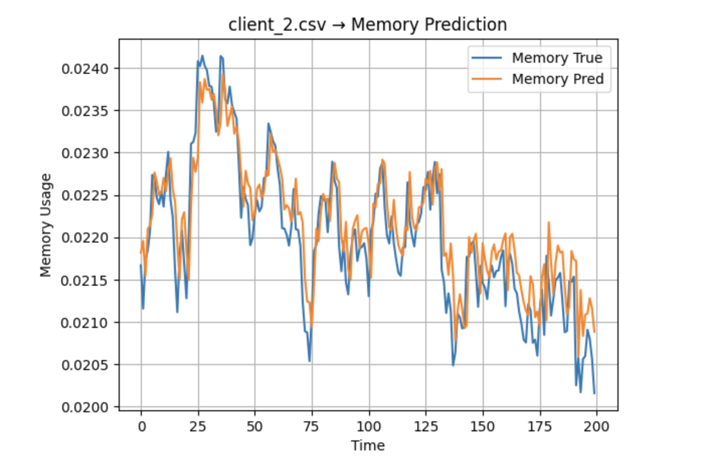

# Federated Resource Usage Prediction using LSTM-Attention and Aquila Optimization

## Overview

This project presents a Federated Learning framework for predicting future CPU and Memory utilization in large-scale cloud environments using the Google Cluster Trace dataset.

The proposed system forecasts average CPU and memory usage for the next 5-minute interval while preserving client privacy by keeping data localized during training. An LSTM-Attention architecture is combined with the Aquila Optimizer to perform adaptive federated model aggregation.

---

## Problem Statement

Efficient resource allocation is a critical challenge in cloud computing environments. Accurate prediction of future resource consumption enables proactive scheduling, improved resource utilization, and reduced operational costs.

This project aims to predict:

* Average CPU Usage
* Average Memory Usage

for the next 5-minute time interval using historical resource usage patterns.

---

## Dataset

**Google Cluster Trace Dataset (2011)**

The dataset contains task-level resource utilization logs collected from production-scale Google clusters.

### Data Processing Pipeline

1. Raw task usage data extraction
2. Data cleaning and preprocessing
3. 5-minute time window aggregation
4. Machine-wise resource aggregation
5. Client creation for federated learning
6. Feature engineering and normalization
7. Sequence generation for time-series forecasting

---

## Project Pipeline



---

## Model Architecture

### LSTM-Attention Network

* Multi-layer LSTM
* Attention Mechanism
* Sequence Length: 30 Time Steps
* Forecast Horizon: Next 5 Minutes

### Federated Learning

* Multiple distributed clients
* Local model training
* Privacy-preserving weight sharing
* Global model aggregation

### Aquila Optimizer

The Aquila Optimizer is used to adaptively aggregate client model parameters during federated training, improving convergence and prediction performance.

---

## Technologies Used

* Python
* PyTorch
* Pandas
* NumPy
* Matplotlib
* Scikit-Learn
* Federated Learning
* Deep Learning

---

## Results

### Federated Training Performance

The model successfully learned resource usage patterns across multiple federated clients while maintaining low prediction errors.

### Client-wise Prediction Error (MSE)

| Client    | CPU MSE    | Memory MSE |
| --------- | ---------- | ---------- |
| Client 2  | 0.00000052 | 0.00000031 |
| Client 19 | 0.00000133 | 0.00000061 |
| Client 12 | 0.00000048 | 0.00000024 |
| Client 36 | 0.00000083 | 0.00000021 |
| Client 39 | 0.00000065 | 0.00000029 |

## Client Performance Comparison



## CPU Usage Forecasting



## Memory Usage Forecasting



---

## Repository Structure

```text
Federated-Resource-Prediction/
│
├── notebook/
│   └── FedAQUILLA.ipynb
│
├── images/
│   ├── pipeline.png
│   ├── client_comparison.png
│   ├── cpu_prediction.png
│   └── memory_prediction.png
│
├── data/
│   └── sample_client.csv
│
├── requirements.txt
├── .gitignore
└── README.md
```

---

## Installation

Clone the repository:

```bash
git clone https://github.com/your-username/Federated-Resource-Prediction.git
```

Install dependencies:

```bash
pip install -r requirements.txt
```

Run the notebook:

```bash
jupyter notebook
```

Open:

```text
FedAQUILLA.ipynb
```

---

## Future Improvements

* Transformer-based forecasting models
* Dynamic client selection strategies
* Multi-horizon forecasting
* Real-time deployment using cloud infrastructure
* Advanced federated optimization techniques

---

## Author

**Madhusudhan**

Data Science | Machine Learning | Federated Learning | Deep Learning
